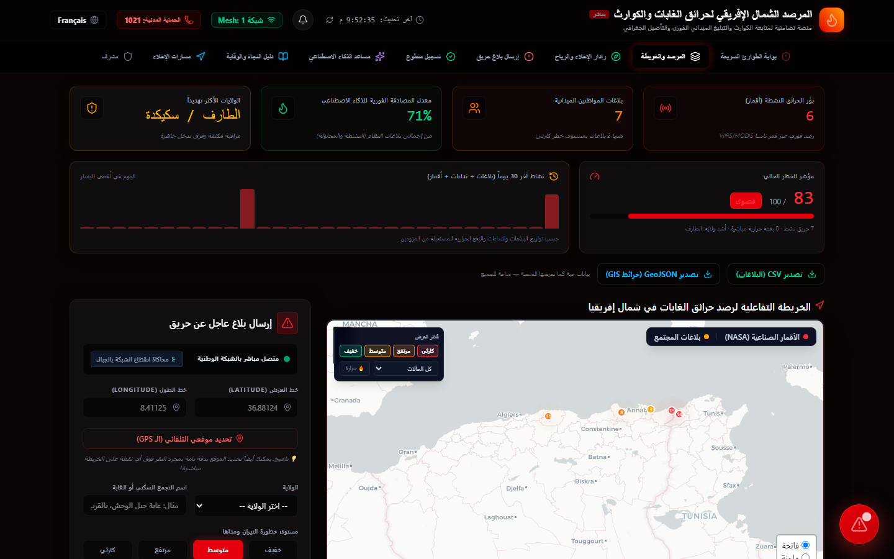
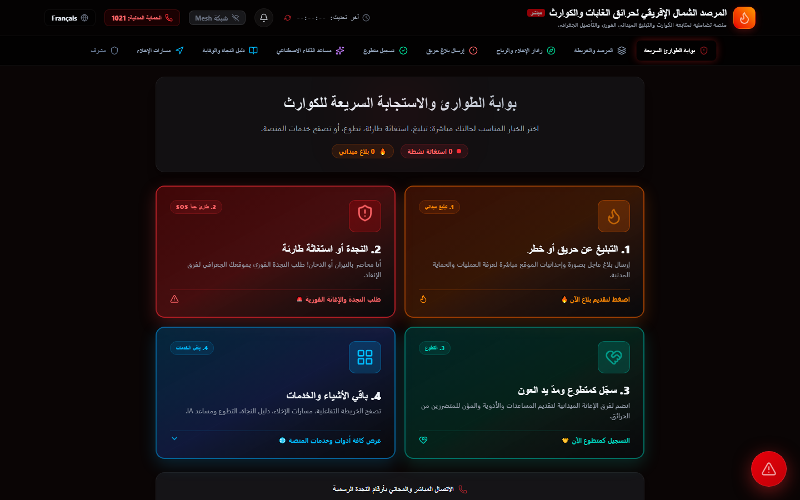
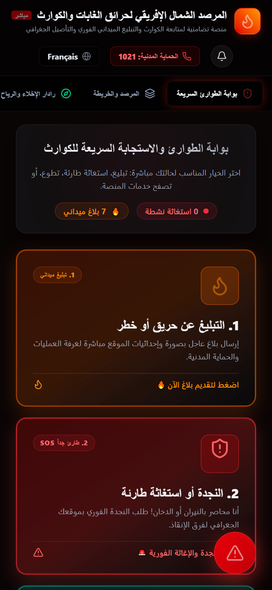

<div align="center">

<h1 align="center">المرصد الجزائري لحرائق الغابات والكوارث</h1>
<p align="center"><strong>Observatoire algérien des feux de forêt et des catastrophes</strong></p>
<p align="center">Algerian Wildfire and Disaster Observatory — Community-Driven Early Warning System</p>

[](https://github.com/DefiAudit0x/wildfire-observatory/actions/workflows/ci.yml)
[](https://wildfire-observatory.onrender.com/)


<p align="center">
  
</p>

</div>

---

## 📋 Table of Contents / فهرس المحتويات

- [Overview / نظرة عامة](#overview)
- [Features / الميزات](#features)
- [Tech Stack / التقنيات](#tech-stack)
- [Satellite & Data Sources / الأقمار ومصادر البيانات](#satellite-data)
- [Architecture / البنية](#architecture)
- [Getting Started / التشغيل](#getting-started)
- [API Documentation / توثيق API](#api-documentation)
- [Testing / الاختبارات](#testing)
- [Docker](#docker)
- [CI/CD](#cicd)
- [Project Status / حالة المشروع](#project-status)

---

<a name="overview"></a>

## 🌍 Overview / نظرة عامة

**AR:** منصة إنسانية مفتوحة المصدر تهدف إلى إنقاذ الأرواح في المناطق المعرضة لحرائق الغابات في شمال أفريقيا (الجزائر، تونس، المغرب، ليبيا). تعتمد المنصة على الذكاء الاصطناعي (Google Gemini) وبيانات الأقمار الصناعية (NASA FIRMS، شبه فورية Near-real-time) والإجماع البشري للتحقق من البلاغات.

**FR:** Plateforme humanitaire open source visant à sauver des vies dans les zones sujettes aux feux de forêt en Afrique du Nord (Algérie, Tunisie, Maroc, Libye). Elle s'appuie sur l'IA (Google Gemini), les données satellitaires (NASA FIRMS, quasi temps réel / near-real-time) et le consensus citoyen pour la vérification des signalements.

---

<a name="features"></a>

## ✨ Features / الميزات

| Feature | Description |
|---|---|
| 🗺️ **Interactive Map** | Near-real-time wildfire monitoring with Leaflet, satellite hotspots (MODIS/VIIRS) & citizen reports |
| 🤖 **AI Verification** | Google Gemini Vision API analyzes uploaded images for fire/smoke detection |
| 🛰️ **Satellite Data** | NASA FIRMS integration (near-real-time over a Cloudflare proxy; unreachable = an honest empty sky, zero fabricated hotspots) |
| 📊 **Fire Risk Index** | Deterministic 0–100 risk indicator from citizen reports, satellite hotspots & wilaya severity |
| 📈 **History & Open Export** | 30-day activity chart + public CSV/GeoJSON export of reports and hotspots |
| 👥 **Consensus Engine** | Citizen upvoting system — 5+ confirmations auto-verifies a report |
| 📍 **Geo-Clustering** | Automatic grouping of nearby reports within 3km radius |
| 🌐 **Bilingual UI** | Arabic / French interface |
| 📱 **PWA** | Offline support via service worker, installable on mobile |
| 🔐 **Admin Panel** | Secure JWT-based moderation, report management, severity control |
| 🧭 **Compass Triangulation** | Device orientation + GPS + camera alignment for precise reporting |
| 🚨 **Proximity Alerts** | Audio/visual alerts for fires within 30km of user location |

### Screenshots / لقطات الشاشة



<p>
  
</p>

---

<a name="tech-stack"></a>

## 🛠️ Tech Stack / التقنيات

> Verified version references for runtime, Docker, and CI are maintained in [`docs/RUNTIME_BASELINE.md`](docs/RUNTIME_BASELINE.md).

### Frontend
| Technology | Usage |
|---|---|
| React 19 | UI framework |
| TypeScript 5.8 | Type-safe JavaScript |
| Vite 6.2 | Build tool & dev server |
| TailwindCSS 4.1 | Utility-first CSS |
| Leaflet 1.9 | Interactive maps |
| Lucide React | Icons |
| Motion 12 | Animations |
| Sentry React | Error monitoring |

### Backend
| Technology | Usage |
|---|---|
| Node.js ≥22.13 | Runtime |
| Express 5 | HTTP server |
| Firebase Firestore | NoSQL database (optional persistence) |
| Google GenAI 2.4 | Gemini AI image verification |
| Helmet | HTTP security headers |
| CORS | Cross-origin resource sharing |
| express-rate-limit | API rate limiting (100 req/min) |
| jsonwebtoken | JWT-based admin authentication |
| Pino 10 | Structured logging |
| Zod 4 | Input validation (schemas) |
| Swagger/OpenAPI | API documentation |
| Sentry Node | Error monitoring |

### DevOps
| Technology | Usage |
|---|---|
| Docker | Multi-stage container build (Node 22) |
| pnpm 11.21.0 | Dependency installation and scripts |
| GitHub Actions | CI/CD pipeline (Node 24: lint → test → build → E2E) |
| Husky | Pre-commit hooks (tsc --noEmit) |

---

<a name="satellite-data"></a>

## 🛰️ Satellite & Data Sources / الأقمار ومصادر البيانات

- **NASA FIRMS** — Near-real-time thermal anomalies (fire hotspots) over the Maghreb region, fetched through a Cloudflare proxy and degraded gracefully to a static snapshot when unreachable (fully offline-safe).
- **MODIS vs VIIRS** — MODIS offers ~1 km resolution with 2–4 passes/day; VIIRS ~375 m with more frequent passes. Every hotspot carries its source satellite, brightness (fire radiative power proxy), confidence and detection time.
- **What a hotspot means** — a thermal anomaly flagged by the sensor is a *signal to verify*, not a confirmed fire. The pipeline cross-checks it against citizen reports, AI image analysis and the consensus engine before status decisions.
- **Confidence** — nominal confidence is normalized to a percentage; high-confidence hotspots (≥70%) trigger proximity alerts.
- **Google Gemini Vision** — AI-assisted image verification (fire/smoke detection) with confidence scoring; outputs are informational and subject to human/consensus review.
- Complete data provenance, endpoints and fallback behavior: [DATA_SOURCES.md](DATA_SOURCES.md).

---

<a name="architecture"></a>

## 🏗️ Architecture / البنية التقنية

```
observatory/
├── server/                    # Express backend
│   ├── server.ts              # Entry point
│   ├── config.ts              # Environment configuration
│   ├── logger.ts              # Pino logger
│   ├── firebase.ts            # Firebase lazy initialization
│   ├── ai.ts                  # Gemini AI client
│   ├── geo.ts                 # Haversine, clustering, wilaya mapping
│   ├── data.ts                # Static wilaya registry (names + emergency phones); v2.3.0 purged all demo reports/hotspots
│   ├── middleware.ts          # JWT auth, error handler
│   ├── swagger.ts             # OpenAPI 3.0 config
│   └── routes/
│       ├── health.ts          # GET /api/health
│       ├── reports.ts         # GET/POST /api/reports, POST confirm
│       ├── admin.ts            # POST /api/admin/verify, update, delete
│       ├── satellite.ts        # GET /api/satellite-data
│       ├── wilayas.ts          # GET /api/wilayas (dynamic stats)
│       └── ai.ts              # POST /api/ai/guidance
├── src/                       # React frontend
│   ├── App.tsx                # Main app with citizen, operational, and admin navigation tabs
│   ├── types.ts               # TypeScript interfaces
│   ├── main.tsx               # Entry with Sentry
│   └── components/
│       ├── InteractiveMap.tsx  # Leaflet map with markers
│       ├── ReportForm.tsx      # Citizen report submission
│       ├── AdminPanel.tsx      # Admin moderation dashboard
│       ├── AICopilot.tsx       # AI guidance assistant
│       ├── EvacuationRadar.tsx # Evacuation radar view
│       ├── SafetyGuides.tsx    # Safety guides
│       ├── StatisticsPanel.tsx # Live stats, fire risk, history & export
│       └── WilayaList.tsx       # Region status list
├── tests/                     # Unit + API + Playwright E2E tests
├── public/                    # PWA assets
├── .github/workflows/ci.yml   # CI/CD pipeline
├── Dockerfile                 # Multi-stage production build
└── vitest.server.config.ts    # Vitest config
```

### Verification Pipeline / خط أنابيب التحقق

```
Report Submitted
    │
    ├─► AI Vision (Gemini) ───► confidence >= 75% → auto-verified
    │     (if image provided)
    │
    ├─► Satellite (NASA FIRMS) ──► hotspot within 3km → +confidence
    │
    └─► Human Consensus ──► 5+ confirmations → auto-verified
          (citizen upvoting)
```

---

<a name="getting-started"></a>

## 🚀 Getting Started / التشغيل

### Prerequisites / المتطلبات

- **Node.js** ≥ 22.13
- **pnpm** 11.21.0

### Installation / التثبيت

```bash
# Clone
git clone https://github.com/DefiAudit0x/wildfire-observatory.git
cd wildfire-observatory

# Install dependencies
pnpm install --frozen-lockfile

# Set environment variables
cp .env.example .env
# Edit .env with your keys:
#   GEMINI_API_KEY — required for AI verification
#   NASA_FIRMS_KEY — optional, for live satellite data
#   ADMIN_PASSWORD — required for admin panel
#   JWT_SECRET — change for production

# Run development server
pnpm run dev
```

Open http://localhost:3000 in your browser.

> 🌐 **Live deployment (Render free tier):** https://wildfire-observatory.onrender.com/ — the free instance sleeps after ~15 min idle; the first request wakes it in ~50 s.

### Environment Variables / متغيرات البيئة

| Variable | Required | Description |
|---|---|---|
| `GEMINI_API_KEY` | ✅ | Google Gemini API key for AI image verification |
| `ADMIN_PASSWORD` | ✅ | Admin panel password (replaces hardcoded `nova2026`) |
| `JWT_SECRET` | ✅ | Secret key for JWT token signing |
| `NASA_FIRMS_KEY` | ❌ | NASA FIRMS API key for live satellite data |
| `NODE_ENV` | ❌ | `development` or `production` (default: `development`) |
| `PORT` | ❌ | Server port (default: `3000`) |
| `LOG_LEVEL` | ❌ | Pino log level: `info`, `debug`, `warn`, `error` |
| `SENTRY_DSN` | ❌ | Sentry DSN for error monitoring |
| `CORS_ORIGINS` | ❌ | Comma-separated allowed origins |
| `GEMINI_MODEL` | ❌ | Gemini model (default: `gemini-3-flash-preview`) |

---

<a name="api-documentation"></a>

## 📖 API Documentation / توثيق API

Full interactive API documentation is available via Swagger UI:

```
http://localhost:3000/api-docs
```

### Endpoints

| Method | Path | Description | Auth |
|---|---|---|---|
| `GET` | `/api/health` | Health check | ❌ |
| `GET` | `/api/reports` | List all reports (clustered) | ❌ |
| `POST` | `/api/reports` | Submit a new report | ❌ |
| `POST` | `/api/reports/:id/confirm` | Upvote/confirm a report | ❌ |
| `GET` | `/api/satellite-data` | Get satellite hotspots (NASA FIRMS) | ❌ |
| `GET` | `/api/wilayas` | Get region statistics | ❌ |
| `POST` | `/api/ai/guidance` | AI safety guidance | ❌ |
| `POST` | `/api/admin/verify` | Admin login (returns JWT) | ❌ |
| `POST` | `/api/admin/reports/:id/update-status` | Update report status/severity | ✅ Bearer JWT |
| `POST` | `/api/admin/reports/:id/delete` | Delete a report | ✅ Bearer JWT |

---

<a name="testing"></a>

## 🧪 Testing / الاختبارات

```bash
# Run server unit tests
pnpm run test:server

# Run React component tests
pnpm run test:react

# Type check
pnpm run lint

# Full build
pnpm run build

# End-to-end tests (Playwright + Chromium)
pnpm exec playwright install chromium
pnpm run test:e2e
```

See `docs/RUNTIME_BASELINE.md` for the verified runtime matrix. Test counts are intentionally not hardcoded here; CI is the authoritative source for current pass/fail state and test totals.

---

<a name="docker"></a>

## 🐳 Docker

```bash
# Build
docker build -t wildfire-observatory .

# Run
docker run -p 3000:3000 --env-file .env wildfire-observatory
```

Multi-stage build:
1. **Builder stage**: `node:22-alpine`, pnpm `11.21.0`, installs dependencies and runs `vite build` + `esbuild`
2. **Production stage**: `node:22-alpine`, non-root `nodejs` user, production dependencies only, lifecycle scripts disabled

---

<a name="cicd"></a>

## 🔄 CI/CD

GitHub Actions pipeline (`.github/workflows/ci.yml`):
1. `pnpm install --frozen-lockfile`
2. `pnpm run lint` (tsc --noEmit)
3. `pnpm run test:server` (vitest)
4. `pnpm run test:react` (vitest)
5. `pnpm run build` (vite + esbuild)
6. Playwright E2E (Chromium) — artifacts uploaded on failure

CI uses Node.js 24 and pnpm 11.21.0. Production Docker remains on Node 22. See [`docs/RUNTIME_BASELINE.md`](docs/RUNTIME_BASELINE.md).

Husky pre-commit hook runs `tsc --noEmit` before each commit.

---

<a name="project-status"></a>

## 📊 Project Status / حالة المشروع

| Area | Status |
|---|---|
| JWT admin auth, rate limiting, Helmet headers, CORS, Zod validation | ✅ Implemented |
| Modular backend with Pino structured logging & centralized error handling | ✅ Implemented |
| Automated tests & CI pipeline | ✅ Implemented |
| Swagger/OpenAPI docs + bilingual README | ✅ Implemented |
| Multi-stage Docker build + GitHub Actions + Husky | ✅ Implemented |
| Sentry monitoring (server + React) | ✅ Implemented |
| PWA offline (Workbox precache + API cache) | ✅ Implemented |
| Full user-flow E2E coverage beyond smoke paths | ⬜ In progress |
| Dependency scanning / dependency review in CI | ✅ Enabled (Dependabot + CodeQL) |
| Load testing & capacity checks | ⬜ Planned |

### What was improved / التحسينات المنجزة

- ✅ **Security**: Replaced hardcoded `nova2026` password with JWT authentication, added Helmet, CORS, rate limiting
- ✅ **Architecture**: Monolithic backend split into modular files
- ✅ **Logging**: `console.log` replaced with Pino structured logger
- ✅ **Error Handling**: Centralized error handler middleware
- ✅ **Testing**: Unit/API + React + Playwright E2E coverage
- ✅ **CI/CD**: GitHub Actions pipeline + Husky pre-commit hooks
- ✅ **API Docs**: Swagger UI at `/api-docs`
- ✅ **Docker**: Multi-stage production build on Node 22
- ✅ **Monitoring**: Sentry integration (server + React)
- ✅ **PWA**: Service worker with offline API caching
- ✅ **Geo Fixes**: Corrected Tunisia/Libya region boundaries

<div align="center">
<p>
  <strong>AR:</strong> مبادرة إنسانية مفتوحة المصدر — <a href="https://facebook.com/groups/1295962545580951/">انضم إلينا</a>
</p>
<p>
  <strong>FR:</strong> Initiative humanitaire open source — <a href="https://facebook.com/groups/1295962545580951/">Rejoignez-nous</a>
</p>
<p>© 2026 DefiAudit</p>
</div>
